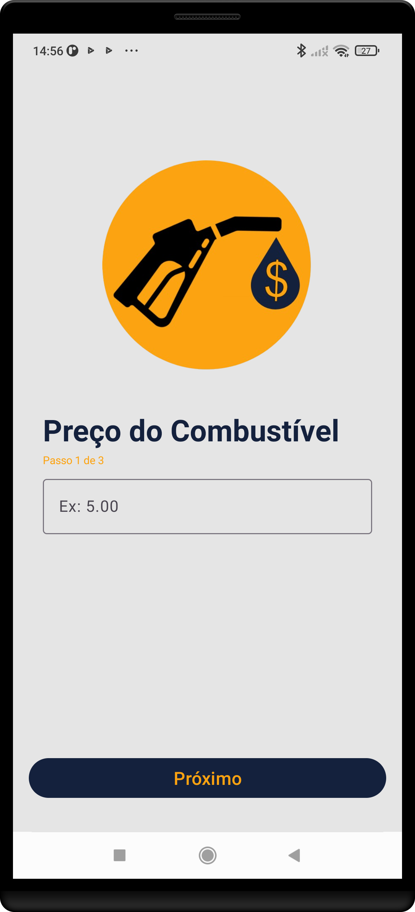

<h2>⛽ Calculadora de Gasto de Combustível </h2>
<ul>
    
Este é um aplicativo Android nativo desenvolvido em Kotlin e XML para calcular o gasto de combustível de uma viagem

</ul>

<h2>📌 Funcionalidades</h2>
<ul>
<li>Tela inicial com botão para iniciar a calculadora</li>
        <li>Usuário insere o preço do combustível</li>
        <li>Usuário informa quantos km o carro faz por litro</li>
        <li>Usuário insere a distância total da viagem</li>
        <li>O aplicativo exibe o gasto total estimado</li>
</ul>

<h2>🚀 Tecnologias Utilizadas</h2>
 <ul>
        <li><strong>Linguagem:</strong> Kotlin</li>
        <li><strong>Layout:</strong> XML</li>
        <li><strong>Navegação:</strong> Intent</li>

<h2>📷 Screenshots</h2>

<h2>Author</h2>

Desenvolvido por <strong>Felipe Mazetti</strong>. Para consultas ou feedback, por favor me contate via <a href="mailto:felipemazetti.dev@gmail.com">felipemazetti.dev@gmail.com</a>.

